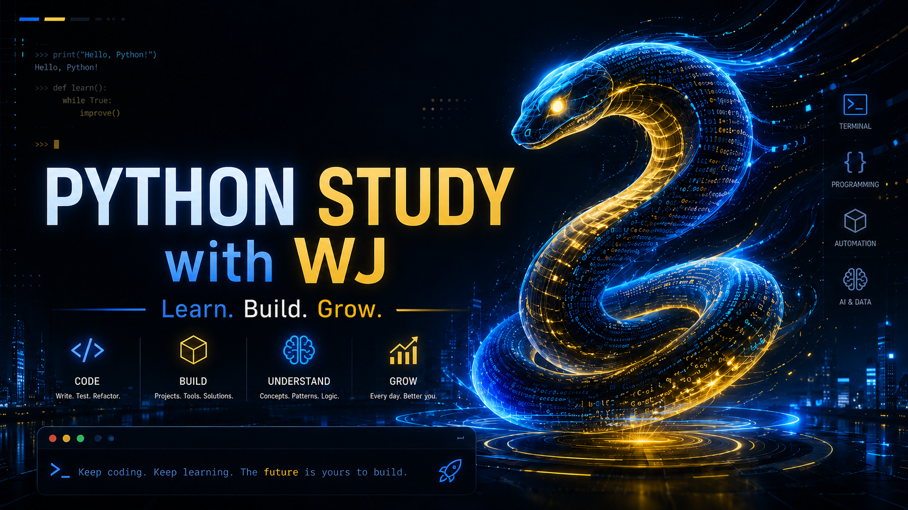

<!-- ╔══════════════════════════════════════════════════════════════════╗ -->
<!-- ║                    PYTHON STUDY with WJ                           ║ -->
<!-- ╚══════════════════════════════════════════════════════════════════╝ -->

<div align="center">



<br/>

# 🐍 Python Study with WJ

### _Learn. Build. Grow._ — 파이썬, 밑바닥부터 제대로.

**한 줄 한 줄 직접 두드리며 쌓아 올리는 파이썬 학습 아카이브**
_A hands-on Python learning archive — built keystroke by keystroke._

<br/>

<!-- ─────────────── Badges ─────────────── -->


<!-- ── Dynamic badges (활성화: repo를 GitHub에 push한 뒤 자동 표시) ── -->


<br/>

[**📚 커리큘럼**](#-커리큘럼-맵--curriculum-map) ·
[**🗂️ 구조**](#️-저장소-구조--repository-structure) ·
[**🎓 코스**](#-학습-코스--courses) ·
[**🗺️ 로드맵**](#️-로드맵--roadmap)

</div>

---

## 👋 소개 · About

> **KR** — 이 저장소는 제가 파이썬을 공부하며 남긴 모든 기록을 한곳에 모은 곳입니다.
> 하버드 **CS50P**와 **점프 투 파이썬**을 두 축으로, 개념 노트 · 실습 코드 · 손으로 짠 예제를 차곡차곡 쌓아 갑니다.
> 목표는 단순합니다 — **최강급 파이썬 학습 저장소** 만들기. 🚀

> **EN** — A single home for everything I write while learning Python.
> Built around two pillars — Harvard's **CS50P** and **Jump to Python** — it collects concept notes, hands-on code, and hand-typed examples.
> The goal is simple: build the **strongest Python study repo** out there. 🚀

### 이 저장소의 세 가지 정체성 · Three identities

| | | |
|:--:|:--|:--|
| 🗃️ | **학습 아카이브** · Learning Archive | 배운 것을 잊지 않도록 남기는 나만의 기록 저장고 |
| 📖 | **공개 교재** · Open Textbook | 같은 길을 걷는 누구나 참고할 수 있는 스터디 자료 |
| 💼 | **성장 포트폴리오** · Growth Portfolio | 꾸준함과 실력을 보여주는 살아있는 이력서 |

---

## 📚 커리큘럼 맵 · Curriculum Map

> 체크리스트가 아니라 **로드맵**입니다. 어디로 향하는지 한눈에 보이도록 그렸습니다.
> _A roadmap, not a checklist — so you can see where this is headed at a glance._

### 🎓 CS50P — Harvard's Introduction to Programming with Python

```
00 · Functions & Variables       함수와 변수         ← 현재 학습 중 / in progress
01 · Conditionals                조건문
02 · Loops                       반복문
03 · Exceptions                  예외 처리
04 · Libraries                   라이브러리
05 · Unit Tests                  단위 테스트
06 · File I/O                    파일 입출력
07 · Regular Expressions         정규 표현식
08 · Object-Oriented Programming 객체 지향 프로그래밍
   · Final Project               최종 프로젝트
```

### 🇰🇷 Jump to Python · 점프 투 파이썬

```
01 · 자료형        Data Types      숫자 · 문자열 · 리스트 · 튜플 · 딕셔너리 · 집합 · 불   ← 진행 중
02 · 제어문        Control Flow    if · while · for
03 · 함수와 입출력  Functions & I/O 함수 · 사용자 입출력 · 파일 읽고 쓰기
04 · 클래스와 모듈  Classes/Modules 클래스 · 모듈 · 패키지 · 예외 처리
05 · 라이브러리    Libraries       내장 함수 · 표준 라이브러리 · 외부 라이브러리
06 · 실전 프로젝트  Projects        직접 만들어 보며 정리
```

<div align="center"><sub>📌 커리큘럼은 학습이 진행되며 계속 확장됩니다 · The curriculum keeps growing as I learn.</sub></div>

---

## 🗂️ 저장소 구조 · Repository Structure

```
PYTHONLOV3WJ/
├── 📁 CS50P/                     # Harvard CS50P 학습 (Python 3.10)
│   └── 01_Functions_Variables/
│       ├── hello.py             #   손으로 짠 실습 코드
│       └── 01.md                #   개념 정리 노트 (EN)
│
├── 📁 Jump2Python/               # 점프 투 파이썬 학습 (Python 3.12)
│   └── 01_DataType/
│       ├── 01_숫자형.ipynb       #   Jupyter 노트북으로 정리한 실습
│       ├── 02_문자열자료형.ipynb
│       ├── 03_리스트자료형.ipynb
│       └── 04_튜플자료형.ipynb
│
├── 📁 assets/                    # 배너 · 이미지 등 정적 리소스
│   └── PythonStudyWJ.png
│
├── 📄 README.md                  # 바로 이 문서
└── 📄 LICENSE                    # MIT
```

각 코스 폴더에는 자체 `README.md`가 있어 세부 목차를 안내합니다.
_Each course folder has its own `README.md` with a detailed table of contents._
→ [CS50P/README.md](CS50P/README.md) · [Jump2Python/README.md](Jump2Python/README.md)
<sub>💡 각 코스를 직접 실행하는 방법(uv 환경 구성)은 해당 폴더의 README에 정리되어 있습니다.</sub>

---

## 🎓 학습 코스 · Courses

<table>
<tr>
<td width="50%" valign="top">

### 🎓 CS50P
**Harvard · Introduction to Programming with Python**

전 세계가 인정하는 하버드의 명강의. 프로그래밍의 원리를 **영어 노트**로 정리하며 기본기를 탄탄히 다집니다.

_Harvard's world-renowned course. Fundamentals, captured in English notes._

- 🐍 Python 3.10
- 📝 개념 노트 + 실습 `.py`
- 🔗 [코스 폴더](CS50P/README.md) · [▶️ 강의 영상](https://www.youtube.com/watch?v=OvKCESUCWII&list=PLhQjrBD2T3817j24-GogXmWqO5Q5vYy0V)

</td>
<td width="50%" valign="top">

### 🇰🇷 Jump to Python
**점프 투 파이썬 · 위키독스**

한국어 파이썬 입문의 정석. **Jupyter 노트북**으로 실행하고 눈으로 확인하며 자료형부터 하나씩 익힙니다.

_The go-to Korean intro. Learn by running, cell by cell._

- 🐍 Python 3.12
- 📓 실행 가능한 Jupyter 노트북
- 🔗 [코스 폴더](Jump2Python/README.md) · [📖 원본 교재](https://wikidocs.net/book/1)

</td>
</tr>
</table>

---

## 🧰 기술 스택 · Tech Stack


---

## 🗺️ 로드맵 · Roadmap

앞으로 이 저장소는 이렇게 자라납니다.
_Where this repo is heading._

- [x] 🌱 CS50P · Jump to Python 학습 시작
- [ ] 📈 두 코스 커리큘럼 완주
- [ ] 🧩 알고리즘 · 코딩테스트 노트 추가
- [ ] 🛠️ 미니 프로젝트 (자동화 · 데이터 · 웹) 폴더 신설
- [ ] 🤖 AI · 데이터 분석 학습 트랙 확장
- [ ] 📚 새로운 코스가 생길 때마다 계속 추가

> 새로운 학습 주제는 상위 폴더로 계속 더해집니다.
> _New topics land as new top-level folders over time._

---

## 📬 연락 · Contact

<div align="center">

**WJ** — 최강급 파이썬 학습자를 향해 🚀

[](https://github.com/devwoo41)
[](mailto:devwooju@gmail.com)

</div>

---

## 📜 라이선스 · License

이 저장소의 코드와 학습 노트는 [**MIT License**](LICENSE)로 배포됩니다. 자유롭게 참고하고 활용하세요.
_The code and study notes in this repository are released under the [**MIT License**](LICENSE). Feel free to learn from them._

> ⚠️ **원저작물 안내 · Original works notice**
> MIT 라이선스는 **제가 직접 작성한 코드와 노트에만** 적용됩니다.
> 원본 강의·교재의 저작권은 각 저작권자에게 있습니다 — **CS50P**는 Harvard University (David J. Malan / CS50), **점프 투 파이썬**은 박응용 및 위키독스(WikiDocs)에 귀속됩니다. 원본 자료는 각 원출처를 참고하세요.
> _The MIT license covers **only my own code and notes.** Course/book copyrights belong to their respective owners — **CS50P** © Harvard University (CS50), **Jump to Python** © 박응용 / WikiDocs._

<div align="center">
<br/>
<sub>⭐ 도움이 되었다면 Star 한 번 부탁드려요! · If this helped, a star means a lot!</sub>
<br/><br/>
<b><i>Keep coding. Keep learning. The future is yours to build.</i></b> 🐍✨
</div>
